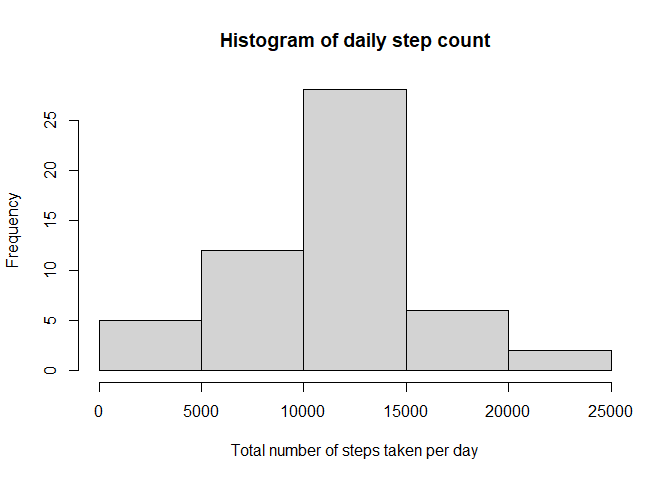
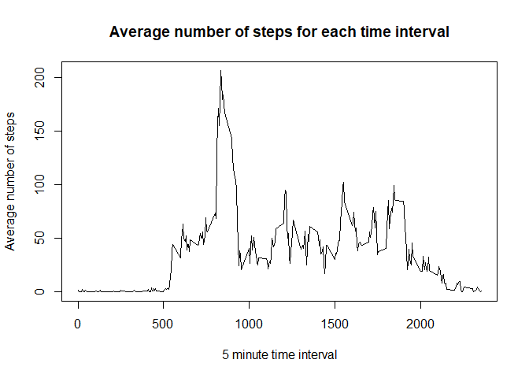
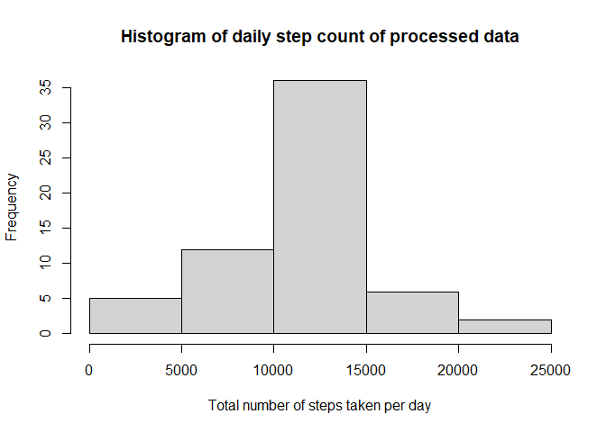
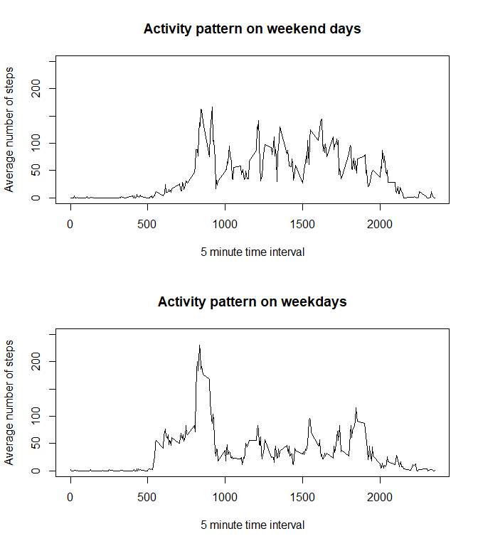

This report is written as part of the John Hopkins course on Reproducible Research
presented on Coursera. The aim of the assignment is to demonstrate how a large 
data set can be utilized in reproducible research by using literate programming. 
The report is produced using r markdown to present both the r code and the 
results of that code together with the written text into one file that is 
knitted into an html file.

A data set has been provided as part of the assignment. The data was collected from
a personal activity monitoring device. During the period of October and November
in 2012 the steps taken by an anonymous individual were recorded in 5 minute 
intervals throughout each day.


## Loading and preprocessing the data

The data needed for the assignment is stored in the [github][1] repository
as a zip file. The assignment instructions require that the first two steps
(calculating the mean for the total daily steps and evaluating the daily activity
pattern) be done on the raw data set which included missing values. 
The third activity involves processing the data by replacing the NA values.


**Obtaining the data from github**

The first step is to download the zip file into a temporary folder. 
From the temporary folder the .csv file is extracted using unz() to unzip the file.


``` r
    dataTemp <- tempfile()

    url1 <- "https://github.com/sandjinn/RepData_PeerAssessment1/blob/master/activity.zip?raw=TRUE"
    
    download.file(url1, dataTemp, mode = "wb")
    
    dataCSV <- read.csv(unz(dataTemp, "activity.csv"))
    
    unlink(dataTemp)
```


## What is mean total number of steps taken per day?

The steps for each day are recorded in 5 minute intervals. In order to calculate
the average (in this case the mean) number of steps per day the total number of steps
taken each day have to be calculated first. 


**Calculate the total number of steps taken per day**

By using the tapply() function the total number of steps per day can be 
calculated using sum.


``` r
    stepsSum <- tapply(dataCSV$steps, dataCSV$date, sum)
```


**Make a histogram of the total number of steps taken each day**

A histogram of the total number of steps taken each day (calculated above) shows 
a fairly normal distribution.


``` r
    hist(stepsSum, main="Histogram of daily step count", 
         xlab="Total number of steps taken per day")
```

<!-- -->


**Calculate and report the mean and median of the total number of steps/day**


``` r
    smean <- mean(stepsSum, na.rm = TRUE)
```


``` r
    smedian <- median(stepsSum, na.rm = TRUE)
```

The mean value of the total number of steps taken per day is 10766.19.

The median of the total number of steps taken per day is 10765.


## What is the average daily activity pattern?

Since the steps are recorded in 5 minute intervals they can be used to investigate
during which parts of the day the individual was the most active.


**Mean for the steps taken during each interval**

The 5 minute intervals are all numbered. A list of numbered intervals is created
using the unique() function.

The average number of steps (mean) that were taken during each time interval are
calculated using a for loop and the results are saved in a data frame dMeans that
will also be used in the next sections to replace the NA values.


``` r
    int <- unique(dataCSV$interval)
    dMeans <- data.frame(Interval=integer(), Mean=integer())

    for(i in int) {
    	
    	m <- mean(subset(dataCSV$steps, dataCSV$interval == i), na.rm=TRUE)
    	dMeans[nrow(dMeans) + 1,] = c(i,m)
    
    }
```


**Plotting the daily activity pattern**

The average number of steps in each time interval can best be visualized as a time
series plot.


``` r
    plot(dMeans$Interval, dMeans$Mean, type = "l", xlab = "5 minute time interval", 
         ylab = "Average number of steps", 
         main = "Average number of steps for each time interval")
```

<!-- -->

**Interval with the highest average number of steps**


``` r
    aveHigh <- max(dMeans$Mean)
    intHigh <- dMeans$Interval[dMeans$Mean == aveHigh]
```

The time series plot above shows the daily activity patterns of the individual
during a two month time period. There are very little activity before time interval 
500 while the most activity takes place between time interval 500 and 1800. 

The highest average number of steps, 206.1698113 were given in interval 835


## Imputing missing values


``` r
    naSum <- sum(is.na(dataCSV))
```

There are a number of missing values in the data set, 2304 in total.

**Strategy for replacing NA values**

The missing values can be replaced in a number of different ways. We know from
the exploratory analysis completed in the steps above that the  total number of steps
taken each day shows a fairly normal distribution and we know from visualizing the
daily activity patterns that the number of steps taken in each time interval varies
based on the time of day. For these reasons it has been decided to take the mean
value of each time interval to replace NA values in that interval.


**Creating a new data set with no missing values**

A new data frame is created (dataNA) which is based of dataCSV but the NA values
are replaced with the mean value for each respective time intervals. The mean for
each interval was calculated in a previous step and saved in dMeans.

The function uses a 'for loop' to test for NA values in each row (r). If the value
is missing the mean value from dMeans for that specific time interval (i) is 
imported into the dataNA$steps column (the first column).


``` r
    dataNA <- dataCSV

    for(r in 1:nrow(dataNA)) {

	    if(is.na(dataNA[r,1])) {
	    	i <- dataNA[r,3]
	    	dataNA[r,1] <- dMeans[dMeans$Interval == i, 2]
	    }
    }
```

**Testing the processed data set against the unprocessed data**

In order to evaluate the impact of replacing the missing values, the first estimated
results obtained on the unprocessed data (dataCSV) is compared to new results obtained
by running the same code on the processed data (dataNA).


``` r
    stepsNASum <- tapply(dataNA$steps, dataNA$date, sum)

    hist(stepsNASum, main="Histogram of daily step count of processed data", 
         xlab="Total number of steps taken per day")
```

<!-- -->


``` r
    smeanNA <- mean(stepsNASum, na.rm = TRUE)
    
    smedianNA <- median(stepsNASum, na.rm = TRUE)
```

The processed data set can be evaluated by comparing the two histograms, 
one for total daily steps calculated using the data set with missing values 
compared to the same but using a data set where the missing values have been replaced.
Overall the shape of the histograms are similar, with the highest frequency
occurring at the 10000 - 15000 total steps interval. The main difference is that
on the transformed data set the frequency has increased.

The mean value for the total number of steps per day is the same between the first
estimate (10766.19) and the processed data (10766.19).

But the median has increased from the estimate (10765) to the processed data
(10766.19).


## Are there differences in activity patterns between weekdays and weekends?

The final question asks if differences can be detected in the activity
patterns recorded on weekdays vs weekends.

**Creating a new vector for weekday/weekend values**

The date on which the steps were recorded are given in the second column of the
processed data set (dataNA$date). By using the as.POSIXlt and weekdays() functions
the day of the week for each calender day can be calculated. Based on this day of the
week a value (weekend or weekday) is added to a fourth column in the data set by
using a 'for loop'. The new column is name 'day'.


``` r
    for (r in 1:nrow(dataNA)) {

	    day <- weekdays(as.POSIXlt(dataNA[r,2]))
	
	    dataNA[r,4] <- ifelse(day == "Saturday" | day == "Sunday", "weekend", "weekday")

    }

    colnames(dataNA)[4]<- "day"
```


**Calculating the means for each interval on the weekdays and weekends**

The mean for each numbered 5 minute time interval can be calculated by subsetting
the processed data set (dataNA) into two, one for weekdays and on for weekends.


``` r
    dWeekday <- subset(dataNA, dataNA$day == "weekday") 
    aveWeekday <- tapply(dWeekday$steps, dWeekday$interval, mean)
    
    dWeekend <- subset(dataNA, dataNA$day == "weekend") 
    aveWeekend <- tapply(dWeekend$steps, dWeekend$interval, mean)
```


**A time series plot to show activity pattern on a Weekday vs the Weekend**


``` r
    int <- unique(dataNA$interval)

    par(mfrow=c(2,1))

    plot(int, aveWeekend, type = "l", xlab = "5 minute time interval", 
        ylab = "Average number of steps", main = "Weekend",
        ylim = c(0, 250))

    plot(int, aveWeekday, type = "l", xlab = "5 minute time interval", 
        ylab = "Average number of steps", main = "Weekday",
        ylim = c(0, 250))
```

<!-- -->


The activity pattern on a weekend differs from that of a weekday in that
the there is a spike in activity on weekdays between time intervals 750 and 950
reaching up to 200 average number of steps. On the weekends the spike during the
same interval is less intense, reaching only up to 150 average steps But in the next period
up to time interval 1900 the number of steps on average are higher on weekends than it is on
weekdays. 

All in all it appears that the time period during which the individual was more
active started and ended later on a weekend than on a weekday. While there was a 
increase in the number of steps early in the morning, on the weekdays the individual
was more active throughout the whole day compared to weekdays.


[1]: https://github.com/rdpeng/RepData_PeerAssessment1
